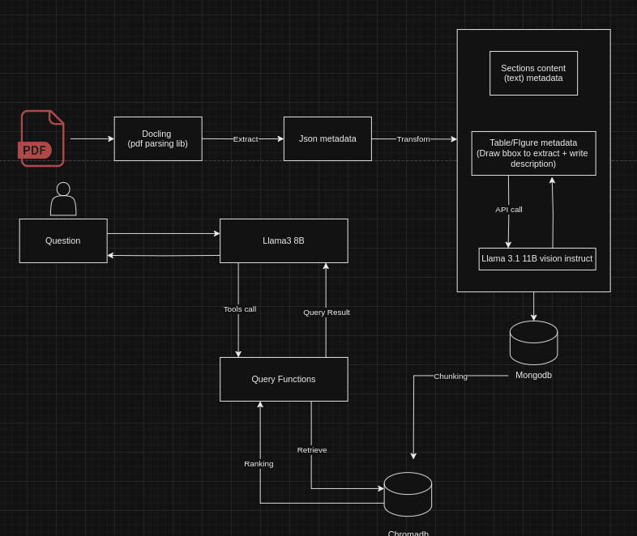

# Folder structure
```
ORAL_PDF_QA/
├── __pycache__/
├── bge_model_ctranslate2/
├── data/
├── parsed/
├── logs/
├── pdf/
├── pictures/
├── tables/
├── venv/
├── .gitignore
├── chroma_service.py
├── config.py
├── gradio_demo.py
├── pdf_parsing_service.py
├── questions.txt
├── README.MD
├── requirements.txt
└── utils.py
```
# Download
```
pip install -r requirements.txt
```
Download `bge_model_ctranslate2` embedding model<br>
Download `parsed` folder at https://drive.google.com/drive/folders/174I-pX1f7_mGG28Wwd9JPOgnOS5O16BA?usp=sharing<br>
Download `tables` folder (extracted tables) from https://drive.google.com/drive/folders/12r0F_Ce25kecUSzp_HvjHjhrV6LbyYyx?usp=sharing<br>
Download `pictures` folder (extracted pictures) from https://drive.google.com/drive/folders/1EvTLNNrBvQr-_lIzZSRL8ayrevKTmtJK?usp=sharing<br>
# Usage

Run chromadb
```
python chroma_service.py
```

Run bot api 
```
python chatbot.py
```
Run demo
```
pyrhon gradio_demo.py
```